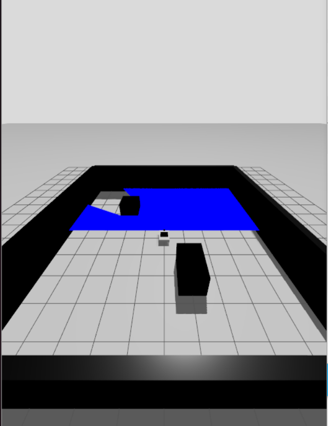

# ROS2 Gazebo Robot Simulation

## 📝 Overview
This repository contains a **ROS2 + Gazebo** simulation for a differential-drive mobile robot.  
The setup includes:
- URDF/Xacro robot description.
- Gazebo world and launch files.
- Basic teleoperation and sensor integration (LiDAR, Lift mechanism).
- ROS2–Gazebo bridge for topic communication.

---

## 📂 Repository Structure
ros2-gazebo-robot/
├── model/
│   └── robot.xacro
│   └── robot.gazebo
├── launch/
│   └── robot.launch.py
├── worlds/
│   └── myworld.sdf
├── parameters/
│   └── ros_gz_bridge.yaml
└── README.md

## Requirements
- ROS2 Jazzy.
- Gazebo.
- ROS2–Gazebo bridge for topic communication.
- 

